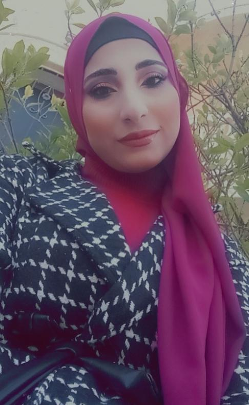
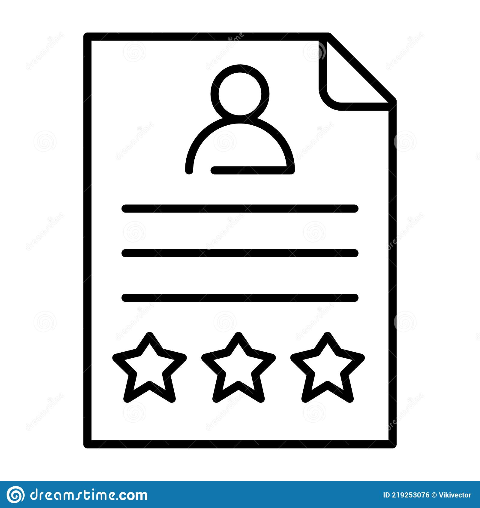

 # 
 # **RAYAN HUSSEIN**

## About me 
>I am a Fullstack Developer, my mark is that I am committed to completing the task as best I can.
My passion is programming.
My goal is to put into practice my talents previously acquired and developed from my academic and social experiences.

#  
##  **Personal information** 

###### **Date of birth :** 10/11/1998 
###### **Nationality :** Lebanese  
###### **Home address :** Borj-Al-Arab, Akkar, North Lebanon  
###### **Mobile phone :** + 961 81294140
###### **E-mail :** rayanfayadhussein98@gmail.com
###### **facebook :** Rayan Hussein

#  

##   **EDUCATION:**   
1. **2021-2022  :** LT - Informatics Software Branch  at Halba technical institute, **Akkar.**
1. **2020-2021 :** TS2- informatics Software Branch at Saadeh technical institute
1. **2018-2021 :** 3 years  at the Lebanese University Mathematics Department   
1. **2017-2018 :**  Public Sciences at Halba High School

#  

# **Computer skills** :   
* Good in : Microsoft Office, HTML, CSS ,JS , JAVA
#  

# **Work experience :** 
* **2017-2018:** teaching particular lessons (all subjects) at private center.
* participated in a training of trainers course (TOT)

#  
# **Hobbies :**
* Basketball
 * Draw 
  * Reading 
#  
# **Languages:** 
* **Arabic :** native
* **French :** excellent
* **English :**  Good  
